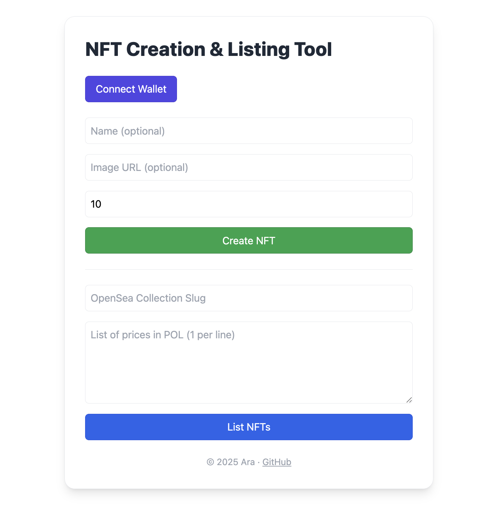

# NFT Creation & Listing Tool

A simple interface for creating and listing NFTs on the [Polygon Amoy Testnet](https://wiki.polygon.technology/docs/pos/amoy/).



## ✨ Features

- 🎨 Generate or upload NFT artwork  
- 🧱 Deploy your own NFT contract (via factory)  
- 🛒 List NFTs on OpenSea using Seaport protocol  
- 🦊 MetaMask integration with automatic Amoy network switching  
- ⚙️ Adjustable mint quantity and listing price  
- 🪪 Fully testnet-based (no real tokens required)  

---

## 🚀 Getting Started

### 1. Install Dependencies

```sh
yarn
```

### 2. Start the Development Server

```sh
cd today-web
yarn start
```

---

## Smart Contract

```sh
yarn deploy:amoy
npx hardhat verify <deployed address> --network amoy --constructor-args scripts/verify-argument.js
```

---

## 🧑‍💻 How to Use

### 📌 Connect Wallet

Click `Connect Wallet` to link your MetaMask.  
If you're not on the **Polygon Amoy testnet**, the app will prompt you to switch or add it automatically.

### 🎨 Create NFT

1. Enter a name (optional)  
2. Upload an image URL or let the app generate one  
3. Set the number of tokens to mint  
4. Click `Create NFT`

> A new ERC-721 contract will be deployed to Polygon Amoy using your wallet.

### 📦 List NFTs on OpenSea

1. Enter the **slug** of your OpenSea collection  
2. Add a list of prices (one per line) in $POL  
3. Click `List NFTs`

The app will use the Seaport protocol to create and submit listings.

---

## 📎 Notes

- This app is for **testnet experimentation only**  
- The deployed contracts use a fixed factory (`0xE2153Bb59801C117763e89C960968c68B0Dc2506`)  
- It assumes your collection is already created on OpenSea testnets  

---

## 🧾 License

© 2025 Ara · [GitHub Repo](https://github.com/avcdsld/nft-creation-tool)
